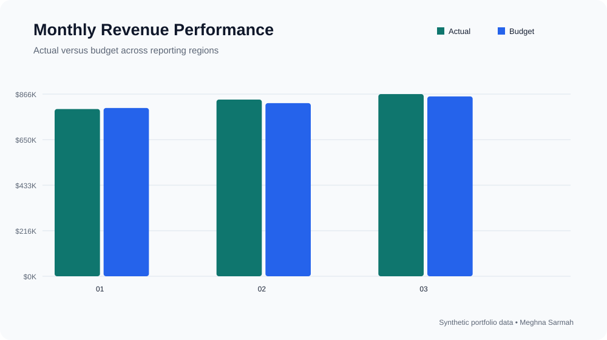

# Financial KPI Dashboard

A Power BI-ready FP&A dashboard project focused on budget performance, profitability, and management reporting.

## Performance visualization

## Dashboard pages

1. **Executive Summary** — revenue, gross margin, EBITDA, and full-year outlook
2. **Budget vs. Actual** — monthly and year-to-date variance
3. **Business Unit Performance** — revenue and margin by region and department
4. **Variance Drivers** — price, volume, cost, and operating-expense movements

## Data model

- Calendar
- Actuals
- Budget
- Accounts
- Departments

The model follows a star schema and can be recreated in Power BI using the included dataset and DAX measures.

## Suggested visuals

- KPI cards for Revenue, EBITDA, EBITDA Margin, and Forecast Accuracy
- Monthly Actual vs. Budget line chart
- Variance waterfall
- Department heat map
- Drill-through detail table

## Business value

The dashboard replaces fragmented monthly reporting with one consistent view of performance and enables finance leaders to identify unfavorable variances earlier.

All data is synthetic.

## Reporting approach

The dashboard is designed around questions management asks during a monthly performance review: Are we ahead or behind plan? Which business unit caused the variance? Is the movement driven by revenue, direct costs, or operating expenses? What requires action before the next reporting cycle?

## KPI definitions

- **Revenue variance:** actual revenue less budgeted revenue
- **Gross profit:** revenue less direct costs
- **EBITDA:** gross profit less operating expenses
- **EBITDA margin:** EBITDA divided by revenue
- **Forecast accuracy:** the closeness of forecasted performance to actual results

## Findings from the sample dataset

- Total revenue is **$2.501M**, which is **$23K above budget**.
- COGS is approximately **$2K above budget**, partially offsetting the favorable revenue result.
- Operating expenses are **$9K above budget**, creating a clear follow-up area for management.

## User experience

The executive page provides a concise performance summary. Users can then drill into month, department, region, category, or account. Consistent measures prevent teams from calculating the same KPI differently, while the variance-driver page keeps discussion focused on actions.

## Repository structure

- **finance_data.csv** — synthetic actual and budget records
- **dax_measures.md** — reusable Power BI measures
- **project-overview.svg** — recruiter-facing dashboard preview

## Skills demonstrated

Power BI, DAX, star-schema design, FP&A reporting, KPI governance, variance analysis, and financial storytelling.
